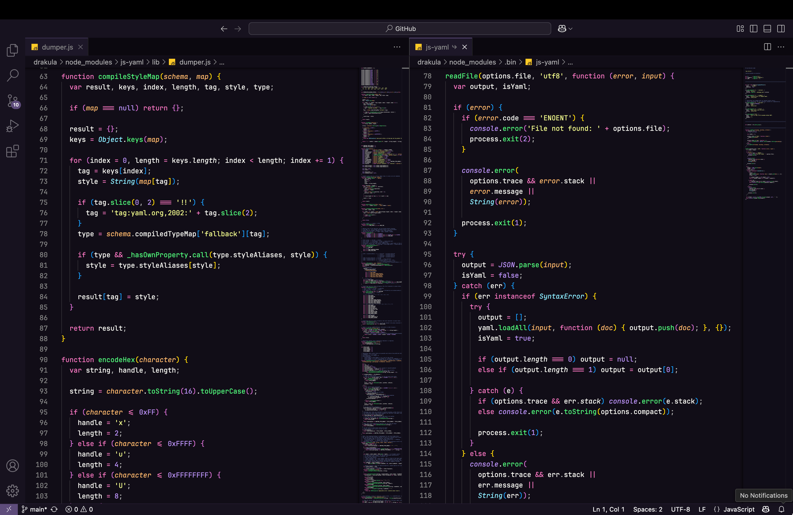

# Drakula

**Drakula** is a dark theme for [Visual Studio Code](https://github.com/microsoft/vscode). This theme is recommended for people who like the [Dracula](https://github.com/dracula/visual-studio-code) color scheme, but prefer a flat and darker UI than the one available in most themes using this scheme. 

## Recommendations

* Font: [JetBrains Mono](https://www.jetbrains.com/lp/mono/) ([Nerd Fonts](https://www.nerdfonts.com/font-downloads) variant)

## Screenshots

