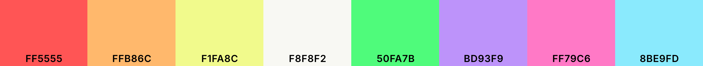
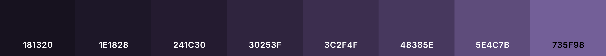
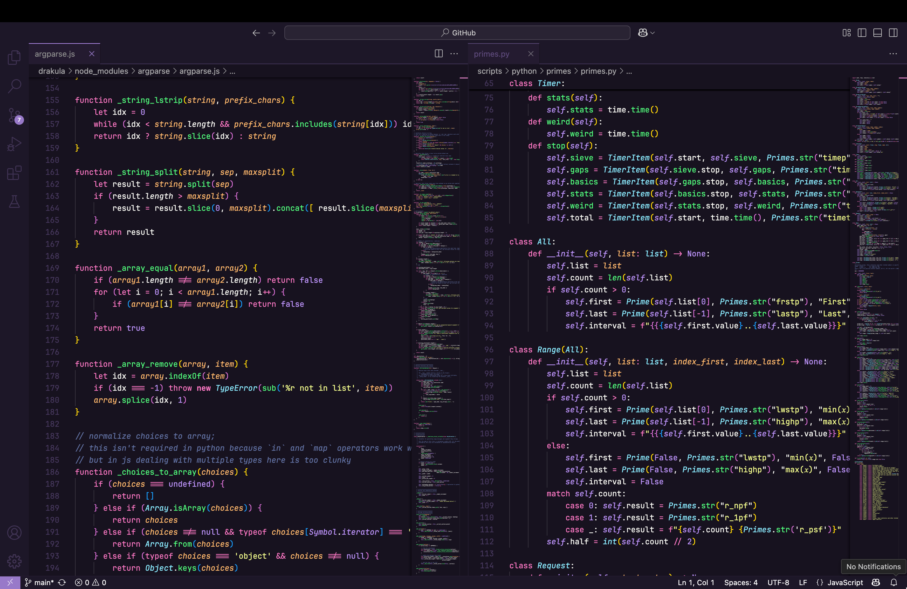
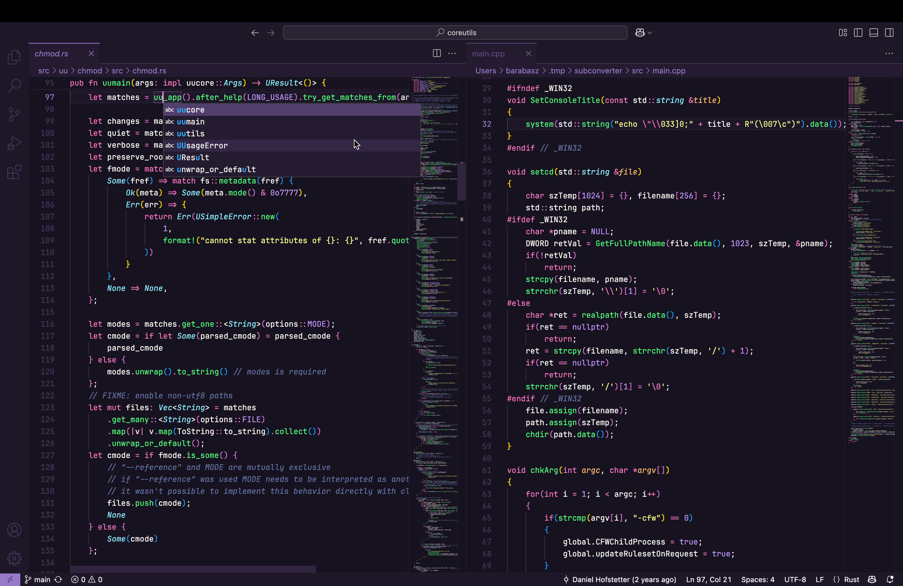

# Drakula

**Drakula** is a dark theme for [Visual Studio Code](https://github.com/microsoft/vscode). This theme is recommended for people who like the [Dracula](https://en.wikipedia.org/wiki/Dracula_(color_scheme)) color scheme, created by [Zeno Rocha](https://zenorocha.com), but prefer more flat and darker UI than the one available in most themes using this scheme. Inspirations include [Tokyo Night](https://marketplace.visualstudio.com/items?itemName=enkia.tokyo-night), [Github](https://marketplace.visualstudio.com/items?itemName=GitHub.github-vscode-theme) and [One Dark Pro](https://marketplace.visualstudio.com/items?itemName=zhuangtongfa.Material-theme).

**Primary foreground colors**:



**Primary background/UI colors**:



**UI example** (Python):


## Installation

### From Marketplace

* open [Visual Studio Marketplace](https://marketplace.visualstudio.com) and search for `Drakula` (or simply [click here](https://marketplace.visualstudio.com/items?itemName=barabasz.drakula-theme))
* click on the "Install" button

### From Visual Studio Code

* go to `View` →  `Command Palette` or press `Cmd+Shift+P`  (`Ctrl+Shift+P` on Windows)
* enter `Install Extension`
* search for `Drakula` and select it or press return to install

## Suggested editor settings

Enable JetBrains Mono font (check "Links & recommendation" section below for download link):

```json
"editor.fontFamily": "JetBrainsMono NF"
```

Reccomended font size with enabled ligatures:

```json
"editor.fontLigatures": true,
"editor.fontSize": 13
```

Smooth cursor behavior and csrolling for better experience:

```json
"editor.cursorBlinking": "smooth",
"editor.cursorSmoothCaretAnimation": "on",
"editor.smoothScrolling": true,
"workbench.list.smoothScrolling": true
```

## Customization

To customize some UI aspects of this theme open user JSON settings:

* Go to `View -> Command Palette` or press `Cmd+Shift+P`  (`Ctrl+Shift+P` on Windows)
* then enter `User Setting JSON`
* select or press return on `Preferences: Open User Settings (JSON)`
* add if not existing `workbench.colorCustomizations` key with section `[Drakula]` like this:

```json
"workbench.colorCustomizations": {
  "[Drakula]": {
    // your customizations goes here
  }
}
```

In the same way you can alter editor behavior by adiding `editor.tokenColorCustomizations` key:

```json
"editor.tokenColorCustomizations": {
  "[Drakula]": {
    // your customizations goes here
  }
}
```

### Changing background

The following example changes editor background color to a lighter purple variant `#241C30`

```json
"workbench.colorCustomizations": {
  "[Drakula]": {
    "editor.background": "#241C30"
  }
}
```

### Disabling italic font variant

Below is an example of disabling the italic font variant for comments:

```json
"editor.tokenColorCustomizations": {
    "[Drakula]": {
        "textMateRules": [{
            "scope": [
                "comment"
            ],
            "settings": {
                "fontStyle": ""
            }
        }]
    }
}
```

## Links & recommendations

* Font: [JetBrains Mono](https://www.jetbrains.com/lp/mono/) ([Nerd Fonts](https://www.nerdfonts.com/font-downloads) variant)
* Icons: [VSCode Great Icons](https://marketplace.visualstudio.com/items?itemName=emmanuelbeziat.vscode-great-icons)
* Other dark themes:
  * [Github](https://marketplace.visualstudio.com/items?itemName=GitHub.github-vscode-theme) (`Dark Default` variant)
  * [One Dark Pro](https://marketplace.visualstudio.com/items?itemName=zhuangtongfa.Material-theme) (`Flat` variant)
  * [Tokyo Night](https://marketplace.visualstudio.com/items?itemName=enkia.tokyo-night) (for much cooler feel)

## Screenshots

### JavaScript and Python



### Rust and C++

