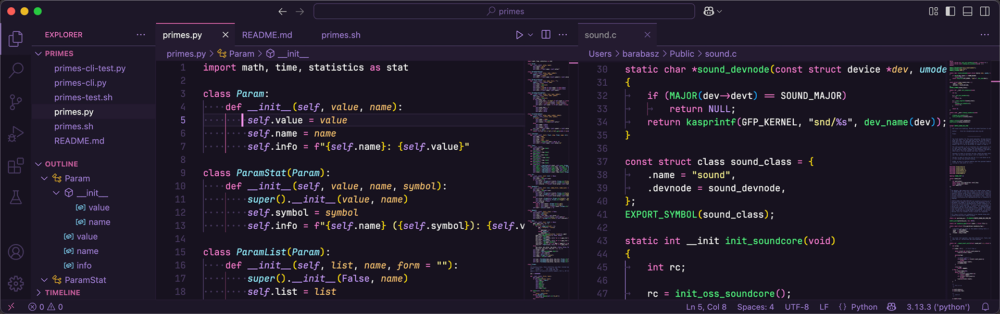
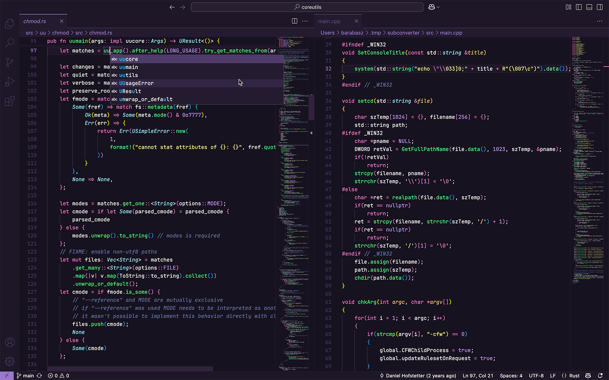
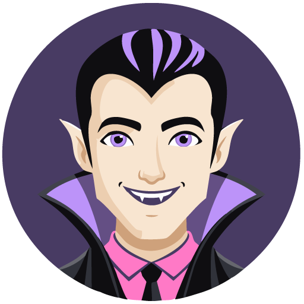

# Drakula

**Drakula** is a dark theme designed for [Visual Studio Code](https://github.com/microsoft/vscode). This theme is particularly suited for individuals who appreciate the [Dracula](https://en.wikipedia.org/wiki/Dracula_(color_scheme)) color scheme, developed by [Zeno Rocha](https://zenorocha.com), yet prefer a flatter and darker user interface compared to what is typically offered in most themes utilizing this scheme. It draws inspiration from the [Tokyo Night](https://marketplace.visualstudio.com/items?itemName=enkia.tokyo-night), [GitHub Dark](https://marketplace.visualstudio.com/items?itemName=GitHub.github-vscode-theme), and [One Dark Pro](https://marketplace.visualstudio.com/items?itemName=zhuangtongfa.Material-theme) themes.

[Features](#key-features) 🟣 [Colors](#color-palette) 🟣 [Interface](#user-interface) 🟣 [Installation](#installation) 🟣 [Settings](#suggested-editor-settings) 🟣 [Customization](#customization) 🟣 [Font](#recommended-fonts) 🟣 [Links](#links-and-acknowledgments) 🟣 [Screenshots](#screenshots)

## Key features

- non-distracting, nearly flat user interface  
- dark theme that minimizes eye strain  
- reduced number of UI colors  
- clear differentiation between highlighting, selection, and searching  

## Color palette

### Primary foreground


### Primary background/UI


### Extra UI and accents


### Bright foreground (highlights and terminal)


## User interface

### UI example (Python)



## Installation

### From Marketplace

* open [Visual Studio Marketplace](https://marketplace.visualstudio.com) and search for `Drakula` (or simply [click here](https://marketplace.visualstudio.com/items?itemName=barabasz.drakula-theme))
* click on the "Install" button

### From Visual Studio Code

* go to `View` →  `Command Palette` or press `Cmd+Shift+P`  (`Ctrl+Shift+P` on Windows)
* enter `Install Extension`
* search for `Drakula` and select it or press return to install

Finally, I would greatly appreciate it if you could rate this theme with [5 stars](https://marketplace.visualstudio.com/items?itemName=barabasz.drakula-theme&ssr=false#review-details)!

## Suggested editor settings

Smooth cursor behavior and csrolling for better experience:

```json
"editor.cursorBlinking": "smooth",
"editor.cursorSmoothCaretAnimation": "on",
"editor.smoothScrolling": true,
"workbench.list.smoothScrolling": true
```

## Customization

To customize some UI aspects of this theme open user JSON settings:

* Go to `View -> Command Palette` or press `Cmd+Shift+P`  (`Ctrl+Shift+P` on Windows)
* then enter `User Setting JSON`
* select or press return on `Preferences: Open User Settings (JSON)`
* add if not existing `workbench.colorCustomizations` key with section `[Drakula]` like this:

```json
"workbench.colorCustomizations": {
  "[Drakula]": {
    // your customizations goes here
  }
}
```

In the same way you can alter editor behavior by adiding `editor.tokenColorCustomizations` key:

```json
"editor.tokenColorCustomizations": {
  "[Drakula]": {
    // your customizations goes here
  }
}
```

### Changing background

The following example changes editor background color to a lighter purple variant `#241C30`

```json
"workbench.colorCustomizations": {
  "[Drakula]": {
    "editor.background": "#241C30"
  }
}
```

### Disabling italic font variant

Below is an example of disabling the italic font variant for comments:

```json
"editor.tokenColorCustomizations": {
    "[Drakula]": {
        "textMateRules": [{
            "scope": [
                "comment"
            ],
            "settings": {
                "fontStyle": ""
            }
        }]
    }
}
```

## Recommended fonts

I strongly recommend the following fonts for use in IDEs and terminals:

### Commit Mono

* download and install [Commit Mono](https://commitmono.com) Nerd Font version [here](https://github.com/ryanoasis/nerd-fonts/releases/download/v3.3.0/CommitMono.zip)
* or simply use brew: `brew install font-commit-mono-nerd-font`
* paste or relpace below settings in VSCode's `settings.json`

```json
    "editor.fontFamily": "CommitMono Nerd Font",
    "editor.fontLigatures": "'cv02', 'cv07', 'cv08', 'ss01', 'ss02', 'ss03', 'ss04', 'ss05'",
```

### JetBrains Mono

* download and install [JetBrains Mono](https://www.jetbrains.com/lp/mono/) Nerd Font version [here](https://github.com/ryanoasis/nerd-fonts/releases/download/v3.3.0/JetBrainsMono.zip)
* or simply use brew: `brew install font-jetbrains-mono-nerd-font`
* paste or relpace below settings in VSCode's `settings.json`

```json
    "editor.fontFamily": "JetBrainsMono NF",
    "editor.fontLigatures": "'calt', 'cv02', 'cv08', 'cv12', 'cv17', 'cv18', 'cv19', 'cv20'",
```

### Common font settings

```json
    "editor.fontWeight": "400",
    "editor.fontSize": 13,
    "editor.letterSpacing": 0.1,
    "editor.lineHeight": 1.45,
```

## Links and acknowledgments

* Icons: [VSCode Great Icons](https://marketplace.visualstudio.com/items?itemName=emmanuelbeziat.vscode-great-icons)
* Other dark themes:
  * [Github](https://marketplace.visualstudio.com/items?itemName=GitHub.github-vscode-theme) (`Dark Default` variant)
  * [One Dark Pro](https://marketplace.visualstudio.com/items?itemName=zhuangtongfa.Material-theme) (`Flat` variant)
  * [Tokyo Night](https://marketplace.visualstudio.com/items?itemName=enkia.tokyo-night) (for much cooler feel)

## Screenshots

### JavaScript and Python


### Rust and C++



<p align="center">
  
</p>

